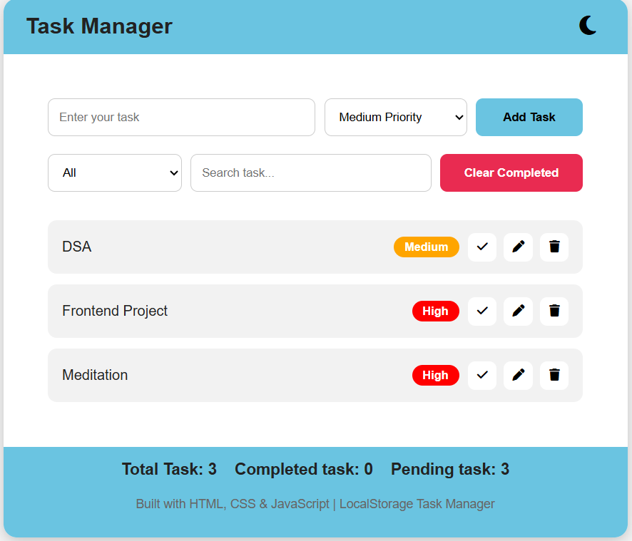
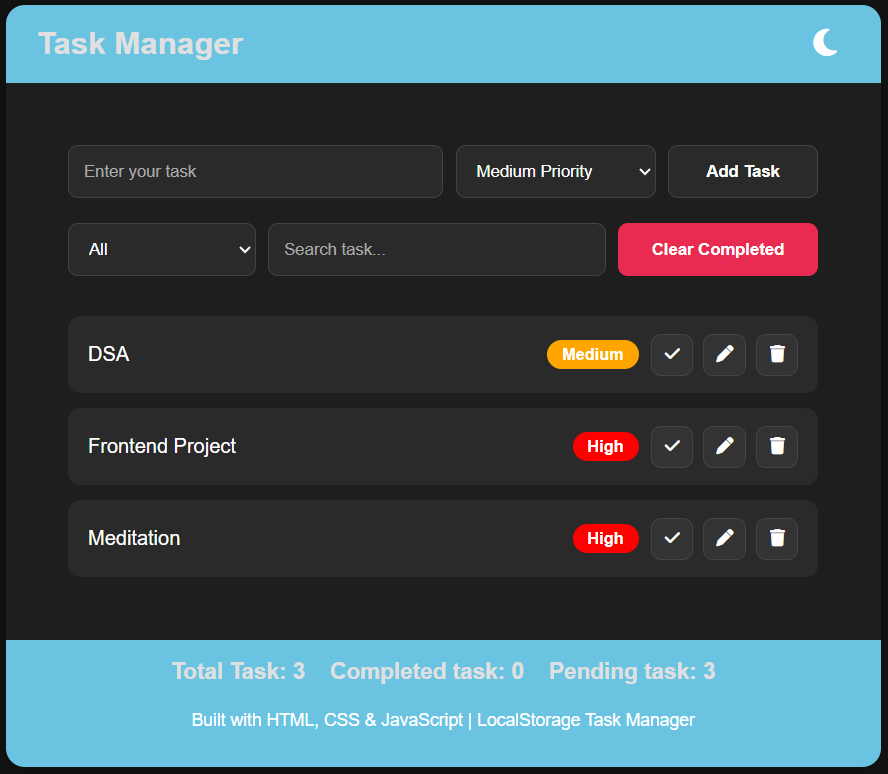
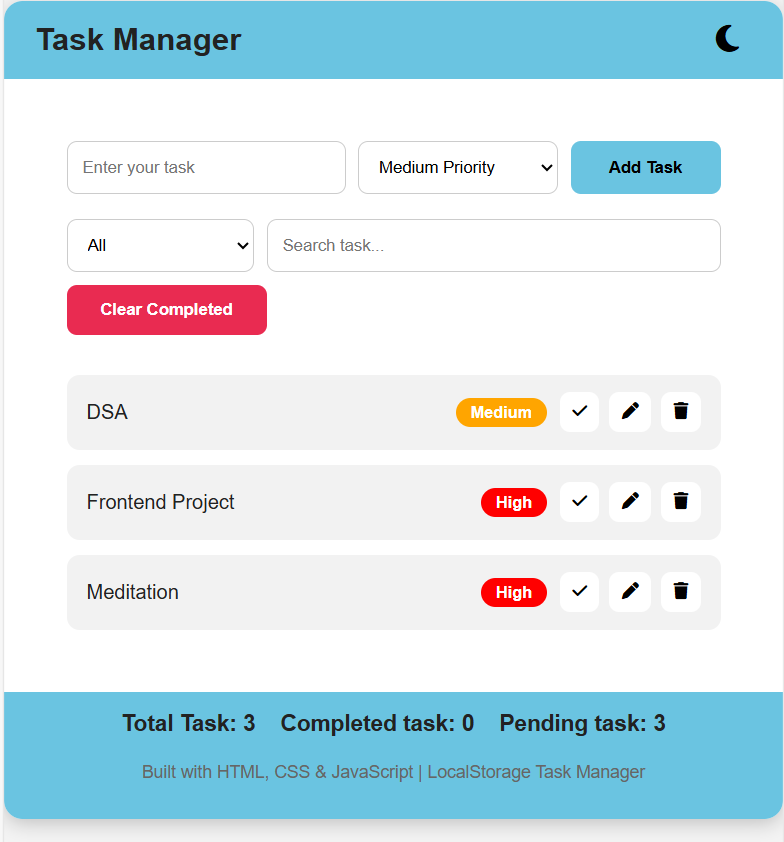

# Task Manager Web App

A clean and responsive Task Manager web application built using **HTML, CSS, and JavaScript**.
It helps users manage daily tasks with priority levels, filtering, searching, dark mode, and LocalStorage support.

---

## Features

Add new tasks
Delete tasks
Edit tasks
Mark tasks as completed
Filter tasks(All/Completed/Pending)
Search tasks
Priority selection(High/Medium/Low)
Clear completed tasks
Dark/Light mode
LocalStorage support(tasks + theme saved)

---

## Tech Stack

- HTML
- CSS
- JavaScript
- LocalStorage

---

## Screenshots

### Light Mode

### Dark Mode

### Mobile View

---

## How to Run Locally

1. Download or clone this repository
2. Open the folder in VS Code
3. Run using Live Server
4. Start managing tasks

---

## Live Demo

https://nithya-task-manager.netlify.app
